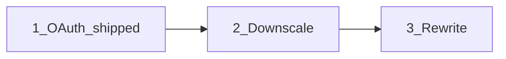

# План реализации roadmap

Опора: [docs/ROADMAP.md](../docs/ROADMAP.md). Порядок — как в suggested order. Rewrite — отдельная поздняя фаза без изменений API текущих релизов.

`export_mailbox` follow-ups (resume по Message-ID, `export_path`, Homebrew formula) — shipped, см. [CHANGELOG](CHANGELOG.md).

---

## 1. OAuth login ([#10](https://github.com/axllent/imap-scrub/issues/10)) — shipped

Реализовано, см. [CHANGELOG](CHANGELOG.md). Отличия от плана ниже:

- `go-sasl` содержит только OAUTHBEARER, XOAUTH2 в нём нет — механизм реализован в `lib/oauth.go` (`Xoauth2Client`, ~20 строк).
- Добавлена зависимость `golang.org/x/oauth2` (закреплена на `v0.30.0`: `v0.36.0` поднимает go directive до 1.25). Endpoint'ы Google заданы константами, чтобы не тянуть `oauth2/google` с `cloud.google.com/go/compute/metadata`.
- Сверх плана: `oauth_auth_url` / `oauth_token_url` / `oauth_scope` — переопределение endpoint'ов для не-Gmail провайдеров (Outlook и т.п.).
- Валидация вынесена в `lib.ValidateAuth()`; `MaskSecrets` теперь прячет `oauth_client_secret`.

Исходный план

**Проблема:** только `Login(user, pass)` в [`main.go`](../main.go) / [`lib/connection.go`](../lib/connection.go).

**Решение (Gmail XOAUTH2 first):**
- Config: `auth: password|oauth2` (default password), поля `oauth_client_id`, `oauth_client_secret`, `oauth_token_file` (refresh token JSON).
- Runtime IMAP login всегда headless-safe: только чтение `oauth_token_file` + refresh access token + `AUTHENTICATE XOAUTH2` (через `github.com/emersion/go-sasl`, уже в vendor). Браузер на машине прогона **не** нужен.
- Setup (`-oauth-setup`) — два режима:
  - **Interactive (default):** local redirect URI + открытие браузера на этой же машине.
  - **Headless / remote:** флаг `-oauth-headless` (или `OAUTH_HEADLESS=1`): напечатать authorization URL → пользователь открывает его на другой машине → вставить code / redirect URL в stdin → обмен на refresh token и запись в `oauth_token_file`. Redirect URI в Google Cloud Console — out-of-band / loopback с ручным копированием (документировать exact redirect).
- Опционально: отдельно сгенерировать token на desktop-машине и скопировать `oauth_token_file` на headless-хост (CI/сервер) — тот же runtime path.
- `ReadConfig`: при `oauth2` не требовать `pass`/`pass_file`.
- README: заменить «OAUTH не поддерживается»; описать оба setup-режима; App Password как альтернативу.

**Файлы:** [`lib/connection.go`](../lib/connection.go), [`lib/config.go`](../lib/config.go), новый `lib/oauth.go`, [`main.go`](../main.go), README.

---

## 2. Attachment downscaling ([#10](https://github.com/axllent/imap-scrub/issues/10))

**Решение:**
- Новое действие `downscale_attachments` **или** опции правила: `downscale_images: true`, `downscale_max_px`, `downscale_quality` (JPEG). Несовместимо с `delete`; совместимо с `save_attachments` (сохранять оригинал до сжатия).
- В [`HandleMessage`](../lib/parser.go): для `image/*` (inline + attachment) — decode → resize (stdlib `image` + `golang.org/x/image` / небольшой JPEG encoder) → записать уменьшенную часть вместо удаления.
- Skip non-images и S/MIME-сообщения (как в `keep_signatures`).
- Лог: original size → new size; в `*-attachments-deleted.txt` — строка «downscaled» если нужен audit trail, либо отдельный note-файл.

**Файлы:** [`lib/parser.go`](../lib/parser.go), [`lib/config.go`](../lib/config.go), новый `lib/images.go`, тесты на PNG/JPEG fixture.

---

## 3. Broader rewrite (long term)

Не в ближайших релизах. Цели из [#10](https://github.com/axllent/imap-scrub/issues/10): более гибкий pipeline правил, меньше «монолитного» `main.go`.

**Направление (когда дойдём):**
- Вынести rule engine: `Search → Filter → Action pipeline` как отдельные интерфейсы.
- Плагиноподобные actions (`delete`, `strip`, `export`, `downscale`) без роста `HandleMessage`.
- Сохранить YAML-совместимость v1 или явный `version: 2` в конфиге.
- До rewrite — только точечные рефакторы под фазы 1–2 (auth interface и т.п.).

---

## Порядок релизов (предложение)

| Релиз | Содержание |
| --- | --- |
| 0.4.0 | OAuth2 (Gmail) — готово в `develop` |
| 0.5.0 | Image downscaling |
| 1.x | Rewrite / config v2 |

После каждой фазы: unit(+integration при наличии IMAP), обновить [docs/CHANGELOG.md](../docs/CHANGELOG.md), вычеркнуть пункт в [docs/ROADMAP.md](../docs/ROADMAP.md).
