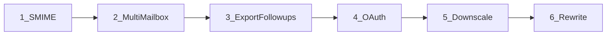

# План реализации roadmap

Опора: [docs/ROADMAP.md](../docs/ROADMAP.md). Порядок — как в suggested order. Rewrite — отдельная поздняя фаза без изменений API текущих релизов.

---

## 1. Preserve S/MIME on `remove_attachments` ([#6](https://github.com/axllent/imap-scrub/issues/6))

**Проблема:** в [`lib/parser.go`](../lib/parser.go) все `AttachmentHeader`-части попадают в `deleted` и не копируются обратно в MIME — подписи `smime.p7m` / `.p7s` / `.p7z` уничтожаются.

**Решение:**
- Добавить в [`Rule`](../lib/config.go) (или account-level с override) флаг `preserve_smime` (`*bool`, **default `true`** при отсутствии в YAML).
- В цикле `HandleMessage`: если preserve включён и имя файла (case-insensitive) — `smime.p7m` / `smime.p7s` / `smime.p7z` (и при необходимости `application/pkcs7-*` Content-Type), **переписать attachment as-is** через `mw.CreateAttachment`, не добавлять в `deleted`.
- Не вызывать `SaveAttachment` для этих частей при `save_attachments` (подпись — не вложение для архива).
- Unit-тесты на фикстуре multipart с `smime.p7s` + обычным attachment: обычный удаляется, S/MIME остаётся.
- Документация: README + короткий note в CHANGELOG; ROADMAP — отметить как shipped.

**Файлы:** [`lib/parser.go`](../lib/parser.go), [`lib/config.go`](../lib/config.go), новый `lib/parser_test.go` / фикстура, README.

---

## 2. Regex / glob `mailbox` ([#9](https://github.com/axllent/imap-scrub/issues/9))

**Проблема:** один `rule.Mailbox` → один `Select` в [`main.go`](../main.go) (~140).

**Решение (конкретно — glob + optional regex):**
- Семантика: если `mailbox` содержит glob-метасимволы (`*`, `?`, `[`) — матчить через `path.Match` / `filepath.Match` по списку папок с сервера; если строка обёрнута в `/.../` — считать regex (`regexp.Compile`). Иначе — точное имя (как сейчас).
- Перед циклом правил (или внутри): `ListMailboxes` / reuse [`lib/mailboxes.go`](../lib/mailboxes.go) → развернуть одно правило в N эффективных `(mailbox, rule)` с подставленным конкретным именем.
- Валидация: пустой match → warning и skip (не fatal), чтобы опечатка в glob не валила весь прогон.
- `-m` без изменений; убрать/смягчить workaround в docs.

**Файлы:** [`lib/mailboxes.go`](../lib/mailboxes.go) (helper `ExpandMailboxPattern`), [`main.go`](../main.go) (expand до Select), [`lib/config.go`](../lib/config.go) (опционально soft-validate), тесты на expand без IMAP.

---

## 3. `export_mailbox` follow-ups

Текущее поведение: [`CreateMBOX`](../lib/utils.go) **падает**, если `mbox` уже есть — resume невозможен.

### 3a. Resume по Message-ID
- При открытии существующего mbox: просканировать заголовки, собрать set `Message-ID`.
- `ExportMessage`: если ID уже в set — skip; иначе append (`O_APPEND`).
- Сообщения без Message-ID: всегда писать (или dedupe по UID+mailbox в sidecar — проще всегда писать и логировать).
- Dry-run: считать would-export / would-skip.

### 3b. Отдельный путь экспорта
- В `YamlConfig` / `Rule`: `export_path` (override `save_path` только для mbox). Default = `save_path`.
- `CreateMBOX` принимает base path.

### 3c. Homebrew formula
- Добавить formula (tap или PR в homebrew-core позже): bottle из GitHub releases `mixeme/imap-scrub`, version sync с тегом.
- Кратко в README (Install).

**Файлы:** [`lib/utils.go`](../lib/utils.go), [`lib/config.go`](../lib/config.go), [`main.go`](../main.go), тесты mbox resume, `Formula/imap-scrub.rb` или docs для tap.

---

## 4. OAuth login ([#10](https://github.com/axllent/imap-scrub/issues/10))

**Проблема:** только `Login(user, pass)` в [`main.go`](../main.go) / [`lib/connection.go`](../lib/connection.go).

**Решение (Gmail XOAUTH2 first):**
- Config: `auth: password|oauth2` (default password), поля `oauth_client_id`, `oauth_client_secret`, `oauth_token_file` (refresh token JSON).
- Runtime IMAP login всегда headless-safe: только чтение `oauth_token_file` + refresh access token + `AUTHENTICATE XOAUTH2` (через `github.com/emersion/go-sasl`, уже в vendor). Браузер на машине прогона **не** нужен.
- Setup (`-oauth-setup`) — два режима:
  - **Interactive (default):** local redirect URI + открытие браузера на этой же машине.
  - **Headless / remote:** флаг `-oauth-headless` (или `OAUTH_HEADLESS=1`): напечатать authorization URL → пользователь открывает его на другой машине → вставить code / redirect URL в stdin → обмен на refresh token и запись в `oauth_token_file`. Redirect URI в Google Cloud Console — out-of-band / loopback с ручным копированием (документировать exact redirect).
- Опционально: отдельно сгенерировать token на desktop-машине и скопировать `oauth_token_file` на headless-хост (CI/сервер) — тот же runtime path.
- `ReadConfig`: при `oauth2` не требовать `pass`/`pass_file`.
- README: заменить «OAUTH не поддерживается»; описать оба setup-режима; App Password как альтернативу.

**Файлы:** [`lib/connection.go`](../lib/connection.go), [`lib/config.go`](../lib/config.go), новый `lib/oauth.go`, [`main.go`](../main.go), README.

---

## 5. Attachment downscaling ([#10](https://github.com/axllent/imap-scrub/issues/10))

**Решение:**
- Новое действие `downscale_attachments` **или** опции правила: `downscale_images: true`, `downscale_max_px`, `downscale_quality` (JPEG). Несовместимо с `delete`; совместимо с `save_attachments` (сохранять оригинал до сжатия).
- В [`HandleMessage`](../lib/parser.go): для `image/*` (inline + attachment) — decode → resize (stdlib `image` + `golang.org/x/image` / небольшой JPEG encoder) → записать уменьшенную часть вместо удаления.
- Skip non-images и S/MIME (фаза 1).
- Лог: original size → new size; в `*-attachments-deleted.txt` — строка «downscaled» если нужен audit trail, либо отдельный note-файл.

**Файлы:** [`lib/parser.go`](../lib/parser.go), [`lib/config.go`](../lib/config.go), новый `lib/images.go`, тесты на PNG/JPEG fixture.

---

## 6. Broader rewrite (long term)

Не в ближайших релизах. Цели из [#10](https://github.com/axllent/imap-scrub/issues/10): более гибкий pipeline правил, меньше «монолитного» `main.go`.

**Направление (когда дойдём):**
- Вынести rule engine: `Search → Filter → Action pipeline` как отдельные интерфейсы.
- Плагиноподобные actions (`delete`, `strip`, `export`, `downscale`) без роста `HandleMessage`.
- Сохранить YAML-совместимость v1 или явный `version: 2` в конфиге.
- До rewrite — только точечные рефакторы под фазы 1–5 (expand mailboxes, auth interface).

---

## Порядок релизов (предложение)

| Релиз | Содержание |
| --- | --- |
| 0.2.0 | S/MIME + multi-mailbox glob/regex |
| 0.3.0 | Export resume + `export_path` + Homebrew |
| 0.4.0 | OAuth2 (Gmail) |
| 0.5.0 | Image downscaling |
| 1.x | Rewrite / config v2 |

После каждой фазы: unit(+integration при наличии IMAP), обновить [docs/CHANGELOG.md](../docs/CHANGELOG.md), вычеркнуть пункт в [docs/ROADMAP.md](../docs/ROADMAP.md).
